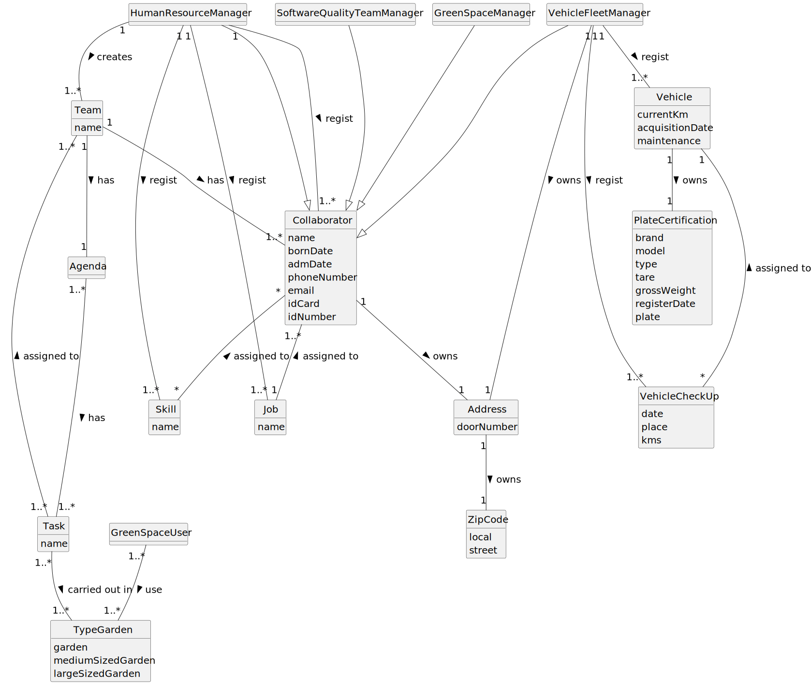

# Introduction
## Purpose and Scope

As part of the Integrative Project (IP), namely in the discipline of Laboratory / 
Project II (LAPR2), the purpose of this document is to gather relevant information 
for the User Manual, intended firstly for the collective use of the MusgoSublime 
organisation and finally for users of the urban green spaces.  
This User Manual describes an urban green space management application 
for the MusgoSublime organisation, additionally with a section that collects feedback from 
users of the urban green spaces managed by this organisation. In this manual, the 
user can find information related to some business transactions (functionalities), 
which are aimed at MusgoSublime members. Subsequently, the user of the urban green 
space can find details on how the application works, namely how to send feedback on 
the urban green space they have used. 
Next, but not less important, there is a section reserved for statistical analysis to 
study some KPIs (key performance indicators) such as: water or energy consumption, the most 
used equipment and the profile of the park's users by age. 
Finally, there is also a section on the implementation of efficient irrigation systems created 
using an algorithm that reads the different routes in a park (topographical survey) and 
defines the most efficient and least expensive route.

# Glossary

**Link to the glossary developed up to and including the 2nd Sprint:**
[Glossary](01.requirements-engineering/glossary.md)

# System Overview

This green space management application aims to speed up and facilitate the entire process of managing a green space, 
being able to register collaborators to be able to generate teams dynamically, and register vehicles to be able to 
manage their check-up's and kilometers. This application works with a small hierarchical system in which the Human 
Resources Manager has the highest permission to register collaborators and generate teams with these same previously 
registered collaborators. The Fleet Manager also has a higher position to register vehicles and record their check-ups.

# Features

>**Register skills | Human Resource Manager**
>
>This feature is important because skills enable employees to perform well on tasks.
>This feature only enables the registration/creation of them.

>**Register a job | Humans Resource Manager**
>
>This feature is important because employees must have a main occupation.

>**Assign one or more skills to a collaborator | Humans Resource Manager**
>
>This feature is important because skills enable employees to perform well on tasks.
>This feature only enables the assignment of them to a employee.

>**Generate a team proposal automatically | Humans Resource Manager**
>
>This feature creates a team considering the set of skills and number of members.
>A team is a temporary association of employees who will carry out a set of tasks in
one or more green spaces.

>**Register a vehicle | Vehicle and Equipment Fleet Manager**
>
>This feature is important because it registers a vehicle.
>Vehicles are needed to carry out the tasks assigned to the teams as well as to transport
machines and equipment.

>**Register a vehicle’s check-up | Vehicle and Equipment Fleet Manager**
>
>This feature is important because it registers a vehicle's check-up.
>Vehicles need maintenance, because they are machines and machines need check-up's.
>That is due to security, economy and durability.

>**List the vehicles needing the check-up | Vehicle and Equipment Fleet Manager**
>
>This feature is important because it lists vehicles which need a check-up.

>**Know the exact costs referring to water
consumption of specific green space | Green Spaces Manager**
>
>This feature goal is to carry out a statistical analysis concerning the water consumption costs in all parks.

>**Know which piece(s) of equipment is/are
used in each day | Green Spaces Manager**
>
>This feature goal is to understand the users preferences.

>**Collect data from the user portal
about the use of the park | Green Spaces Manager**
>
>This feature goal is to understand the use of the park
by different age groups.

>**Import a .csv file containing lines with: Water Point X, Water Point Y, Distance into a unique data structure | Green Spaces Manager**
>
>This feature is important to get all possible routes.

>**Apply an algorithm that returns the routes
to be opened and pipes needed to be laid with a minimum accumulated
cost | Green Spaces Manager**
>
>This feature is important to get the minimum cost between routes and respective pipes.

>**Run tests for inputs of variable size |  Software Quality Assessment Team Manager**
>
>This feature is important to observe the asymptotic behavior of the execution time of the US13
algorithm.