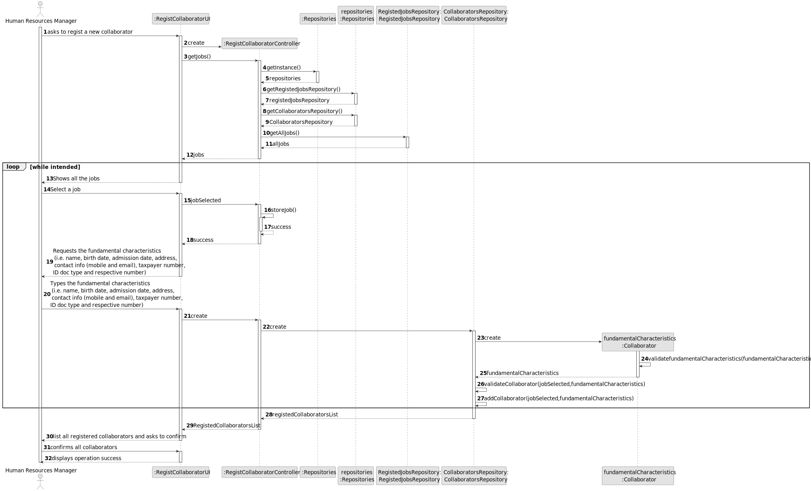
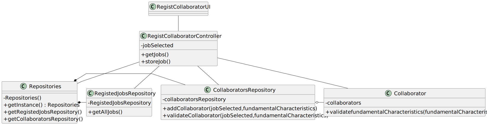

# US003 - Register Collaborator Job & Skills

## 3. Design - User Story Realization 

### 3.1. Rationale

_**Note that SSD - Alternative One is adopted.**_

| Interaction ID | Question: Which class is responsible for...   | Answer                       | Justification (with patterns)                                                                                 |
|:-------------  |:----------------------------------------------|:-----------------------------|:--------------------------------------------------------------------------------------------------------------|
| Step 1  		 | 	... interacting with the actor?              | RegistCollaboratorUI         | Pure Fabrication: there is no reason to assign this responsibility to any existing class in the Domain Model. |
| 			  		 | 	... coordinating the US?                     | RegistCollaboratorController | Controller                                                                                                    |
| 			  		 | 	... instantiating a new Collaborator?        | Repositories                 | CollaboratorsRepository has a Collaborator.                                                                   |
| Step 2  		 | 							                                       |                              |                                                                                                               |
| Step 3  		 | 	...saving the inputted data?                 | Collaborator                 | IE: object created in step 1 has its own data.                                                                |
| Step 4  		 | 	                                             |                              |                                                        |
| Step 5  		 | 	... informing operation success?         | RegistCollaboratorUI                         | IE: object created in step 1 is classified in one Category.                                                   |

### Systematization ##

According to the taken rationale, the conceptual classes promoted to software classes are: 

* Collaborator

Other software classes (i.e. Pure Fabrication) identified: 

* RegistCollaboratorUI  
* RegistCollaboratorController

## 3.2. Sequence Diagram (SD)

_**Note that SSD - Alternative Two is adopted.**_

### Full Diagram

This diagram shows the full sequence of interactions between the classes involved in the realization of this user story.

## 3.3. Class Diagram (CD)

