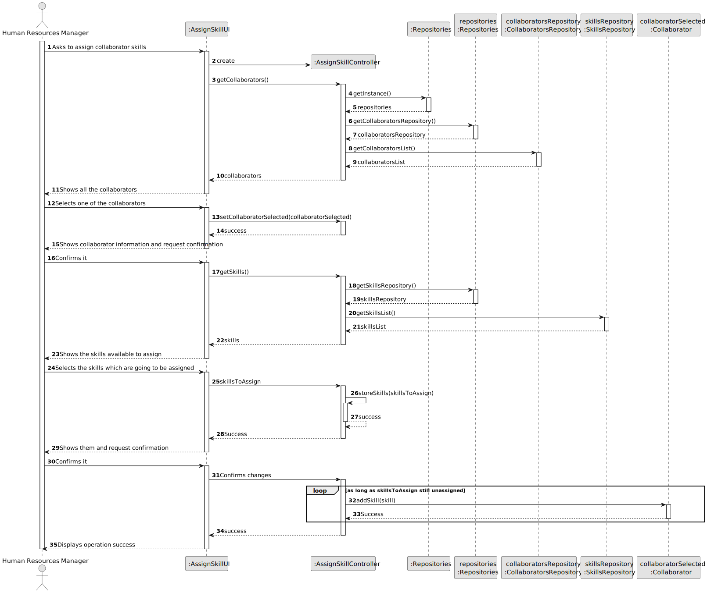
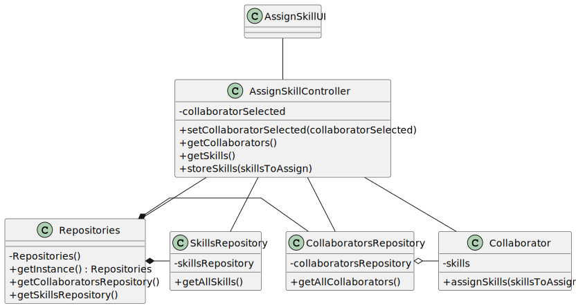

# US004 - Assign one or more skills to a collaborator 

## 3. Design - User Story Realization

### 3.1. Rationale

_**Note that SSD - Alternative One is adopted.**_

| Interaction ID | Question: Which class is responsible for...     | Answer                | Justification (with patterns)                                                                                 |
|:---------------|:------------------------------------------------|:----------------------|:--------------------------------------------------------------------------------------------------------------|
| Step 1  		     | 	... interacting with the actor?                | AssignSkillUI         | Pure Fabrication: there is no reason to assign this responsibility to any existing class in the Domain Model. |
| 			  		        | 	... coordinating the US?                       | AssignSkillController | Controller                                                                                                    |
| 			  		        | 	... instantiating a new CollaboratorRepository? | Repositories          | Creator (Rule 1): Repositories aggregates instances of CollaboratorList.                                      |
| 			  		        | ... knowing the user using the system?          | UserSession           | IE: cf. A&A component documentation.                                                                          |
| 			  		        | 							                                         | CollaboratorRepository | IE: knows/has its own Collaborators                                                                           |
| 			  		        | 							                                         | Collaborator          | IE: knows its own data (e.g. email)                                                                           |
| Step 2  		     | 							                                         |                       |                                                                                                               |
| Step 3  		     | 	...saving the inputted data?                   | AssignSkillController                  | IE: object created in step 1 has its own data.                                                                |
| Step 4  		     | 							                                         |                       |                                                                                                               |               |
| Step 5  		     | 	... informing operation success?               | AssignSkillUI         | IE: is responsible for user interactions.                                                                     | 

### Systematization ##

According to the taken rationale, the conceptual classes promoted to software classes are: 

* Collaborator

Other software classes (i.e. Pure Fabrication) identified: 

* AssignSkillUI  
* AssignSkillController

## 3.2. Sequence Diagram (SD)

_**Note that SSD - Alternative One is adopted.**_

### Full Diagram

This diagram shows the full sequence of interactions between the classes involved in the realization of this user story.

## 3.3. Class Diagram (CD)

