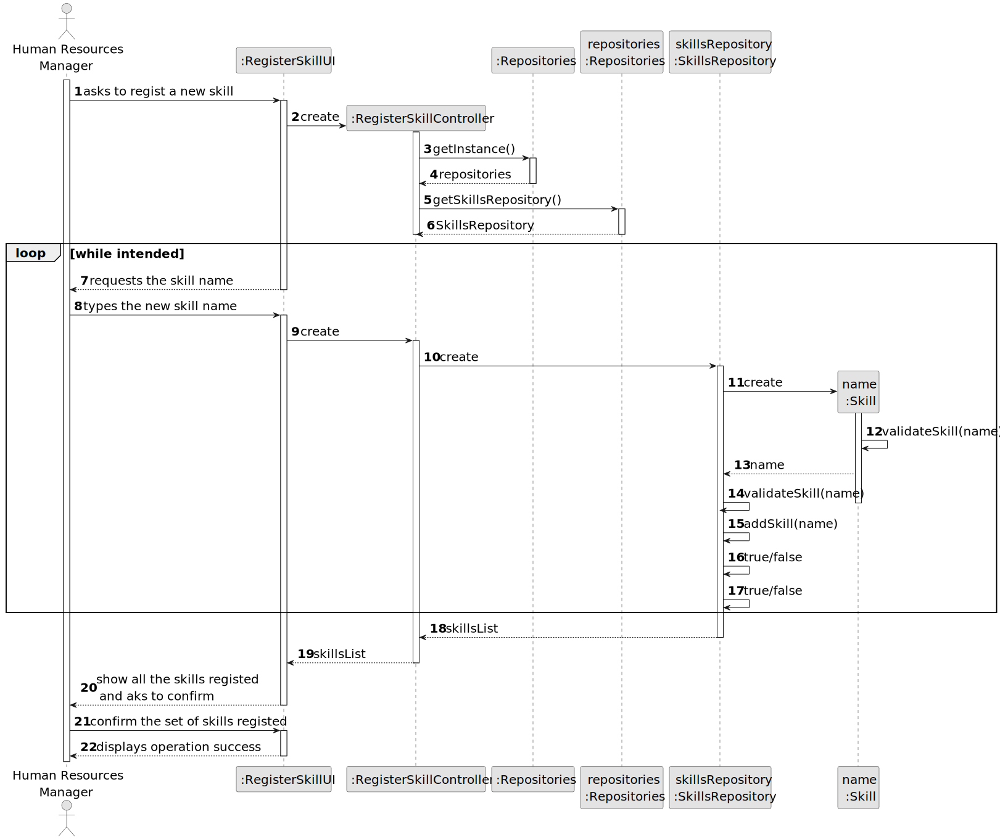
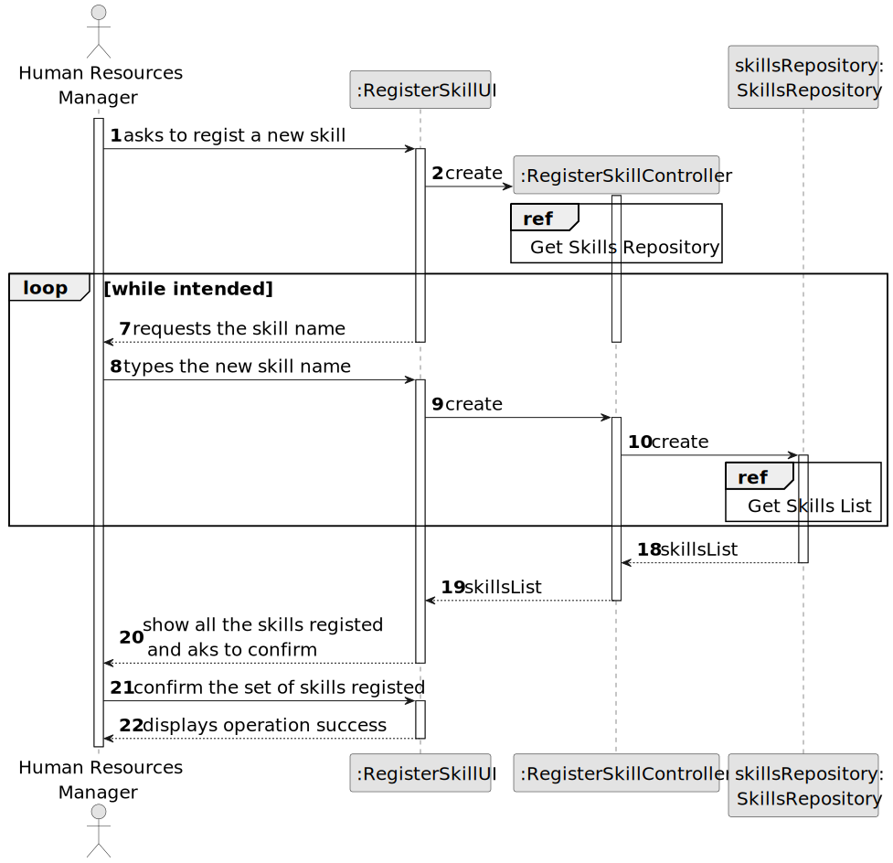
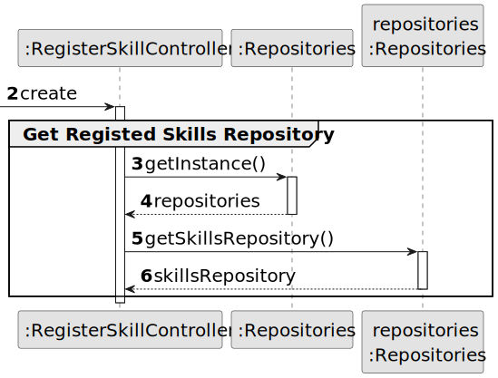
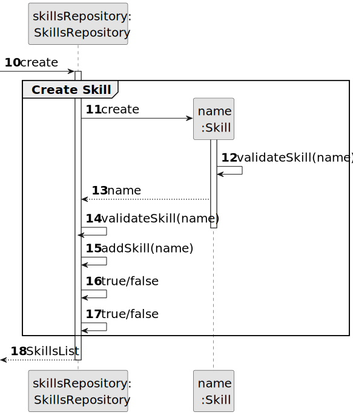
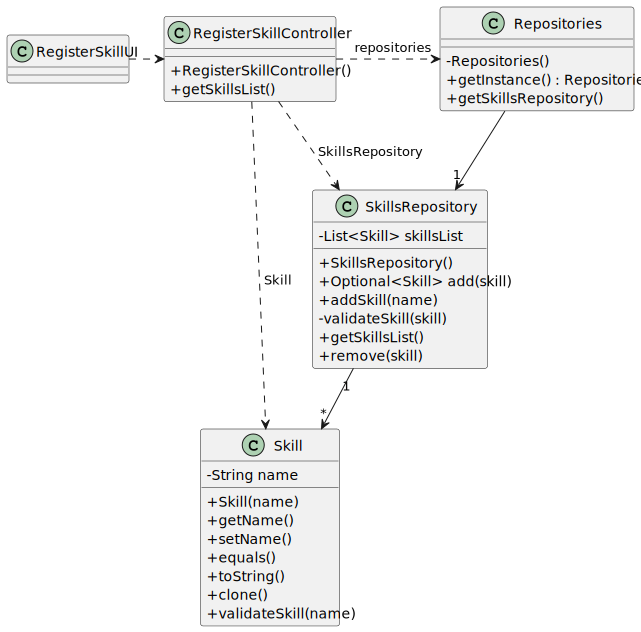

# US001 - Register Skill

## 3. Design - User Story Realization 

### 3.1. Rationale

_**Note that SSD is adopted.**_

| Interaction ID  | Question: Which class is responsible for...              | Answer                  | Justification (with patterns)                                                                                 |
|:----------------|:---------------------------------------------------------|:------------------------|:--------------------------------------------------------------------------------------------------------------|
| Step 1  		   | 	... interacting with the actor?                       | RegisterSkillUI         | Pure Fabrication: there is no reason to assign this responsibility to any existing class in the Domain Model. |
| 			  	   | 	... coordinating the US?                              | RegisterSkillController | Controller                                                                                                    |
| 			  	   | 	... instantiating a new Skill?                        | Repositories            | SkillsRepository has a Skill.                                                                                 |
| Step 2  		   | 	                                                      |                         |                                                                                                               |
| Step 3  		   | 	...saving the inputted data?                          | Skill                   | IE: object created in step 1 has its own data.                                                                |
| Step 4  		   | 	...knowing the task categories to show?               | System                  | IE: Task Categories are defined by the Administrators.                                                        |
| 		           | 	... saving the selected category?                     | Skill                   | IE: object created in step 1 is classified in one Category.                                                   |
| Step 5  		   | 	... validating all data (local validation)?           | Skill                   | IE: owns its data.                                                                                            |
| 			  	   | 	... validating all data (global validation)?          | SkillsRepository        | IE: knows all its skills.                                                                                     |
| 			  	   | 	... saving the created skill?                         | SkillsRepository       | IE: owns all its skills.                                                                                      |
| Step 6  		   | 	... informing operation success?                      | RegisterSkillUI         | IE: is responsible for user interactions.                                                                     |

### Systematization ##

According to the taken rationale, the conceptual classes promoted to software classes are: 

* Collaborator
* SKill

Other software classes (i.e. Pure Fabrication) identified: 

* RegisterSkillUI  
* RegisterSkillController
* Repositories
* SkillsRepository

## 3.2. Sequence Diagram (SD)

_**Note that SSD - Alternative Two is adopted.**_

### Full Diagram

This diagram shows the full sequence of interactions between the classes involved in the realization of this user story.

### Split Diagrams

The following diagram shows the same sequence of interactions between the classes involved in the realization of this user story, but it is split in partial diagrams to better illustrate the interactions between the classes.

It uses Interaction Occurrence (a.k.a. Interaction Use).

**Get Registed Skills Repository Partial SD**

**Create Skill Partial SD**

## 3.3. Class Diagram (CD)

