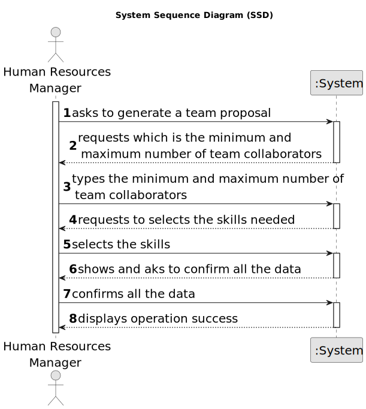

# US005 - Generate Team Proposal

## 1. Requirements Engineering

### 1.1. User Story Description

As an organization employee (HRM), I want to Generate a Team Proposal automatically that may be selected to .

### 1.2. Customer Specifications and Clarifications 

**From the specifications document:**

Teams are temporary associations of employees who will carry out a set of tasks in one or more green spaces. When creating multipurpose teams, the number of members and the set of skills that must be covered are crucial.

**From the client clarifications:**

> **Question:** What information will the customer provide?
>
> **Answer:** The customer provide the max size of the team and a set of skills.

> **Question:** What should the output of the automation be? (should it just store the team proposal or show it to the customer?)  Will the team proposal be a document about all the instructions of each team member/worker?
>
> **Answer:** The systems provide team proposals and HRM can accept of refuse the proposals. In the future (not in this sprint) HRM may decide to edit the team.

> **Question:** How does it generate the team if there are not enough employees?
>
> **Answer:** The system should provide information why it can't generate a team.

> **Question:** How does he propose a team, for what purpose? (Is there any predefinition)?
>
> **Answer:** There is no purpose, at least in this sprint.

> **Question:** What are the input data to automatically generate a team?
> 
> **Answer:** The max size of the team (for instance 4) and the skill needed: 4 tree pruner and 1 light vehicle driver meaning that one team member have 2 skills.

> **Question:** I would like to ask if, in this US, there should be any more information in the team generated beyond the collaborators in which it consists?
> 
> **Answer:** The information should contain each of team members and the its skills.

> **Question:** I would also like to know if a collaborator can be in more than one team at the same time?
>
> **Answer:** No.

> **Question:** I would to know which business rules apply for the input data to generate a team proposal.
>
> **Answer:** max and min team size, and a list of skills needed. For instance: min: 3 max: 4

> **Question** Se, hipoteticamente, tivermos definidas as minSize e as maxSize da equipa como 3 e 5 respetivamente e ao verificar quantos colaboradores têm as respetivas skills chegamos à conclusao que temos 6 colaboradores com as skills necessárias, como é suposto sabermos se precisamos de gerar uma team com 3, 4 ou 5 elementos e qual o elemento para deixar de fora ?
>
> **Answer** Algumas palavras chave que podem ajudar: Critérios (por exemplo, minimizar o número de elementos), Ordenação (de acordo com os critérios escolhidos), Algoritmos (apresentar propostas e interagir com o gestor de recursos humanos)

### 1.3. Acceptance Criteria

* **AC1:** The max and minimum team size and the set of skills must be supplied by the HRM, like in the following example:
  4; 3; <tree pruner; tree pruner; tree pruner; light vehicle licence>

### 1.4. Found out Dependencies

* There is a dependency on "US003 - Register Collaborator Job & Skills" and on "US001 - Register Skills to Collaborators", because to generate a proposal team, should have registed the collaborator and skills first.

### 1.5 Input and Output Data

**Input Data:**

* Typed data:
    * The maximum size of the team
    * The minimum size of the team
    * The skills needed
	
* Selected data:
    * The max size of the team
    * The minimum size of the team
    * The skills needed 

**Output Data:**

* Generated Team Proposal

### 1.6. System Sequence Diagram (SSD)

### 1.7 Other Relevant Remarks

* 