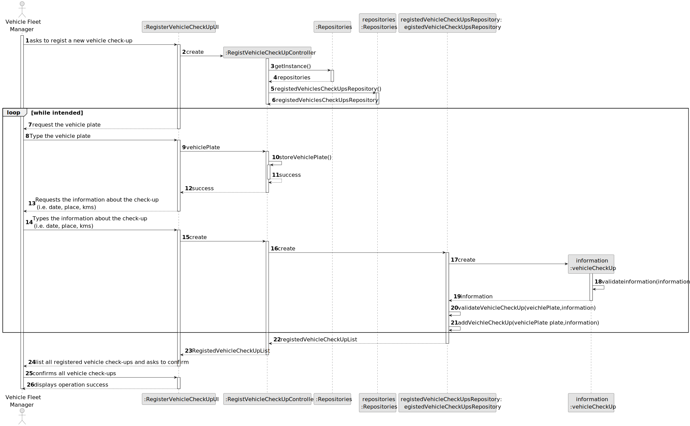
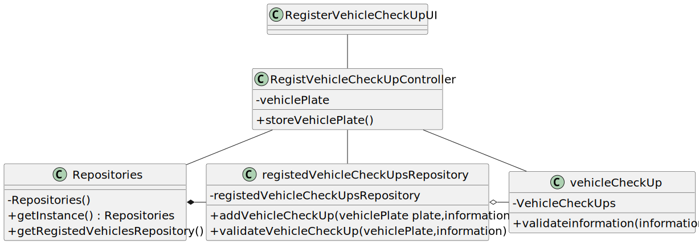

# US007 - Register Vehicle´s Check-up

## 3. Design - User Story Realization 

### 3.1. Rationale

_**Note that SSD - Alternative One is adopted.**_

| Interaction ID | Question: Which class is responsible for...   | Answer               | Justification (with patterns)                                                                                 |
|:-------------  |:----------------------------------------------|:---------------------|:--------------------------------------------------------------------------------------------------------------|
| Step 1  		 | 	... interacting with the actor?              | RegisterVehicleCheckUpUI         | Pure Fabrication: there is no reason to assign this responsibility to any existing class in the Domain Model. |
| 			  		 | 	... coordinating the US?                     | RegistVehicleCheckUpController | Controller                                                                                                    |
| 			  		 | 	... instantiating a new VehicleCheckUp?                  | Repositories         | Creator (Rule 1): in the DM Organization has a Task.                                                          |
| Step 2  		 | 							                                       |                      |                                                                                                               |
| Step 3  		 | 	...saving the inputted data?                 | VehicleCheckUp                 | IE: object created in step 1 has its own data.                                                                |
| Step 4  		 | 	   |               |                                                         |
| Step 5  		 | 	... informing operation success?             | RegisterVehicleCheckUpUI                 | IE: object created in step 1 is classified in one Category.                                                   |

### Systematization ##

According to the taken rationale, the conceptual classes promoted to software classes are: 

* VehicleCheckUp

Other software classes (i.e. Pure Fabrication) identified: 

* RegisterVehicleCheckUpUI  
* RegistVehicleCheckUpController

## 3.2. Sequence Diagram (SD)

_**Note that SSD - Alternative Two is adopted.**_

### Full Diagram

This diagram shows the full sequence of interactions between the classes involved in the realization of this user story.

## 3.3. Class Diagram (CD)

