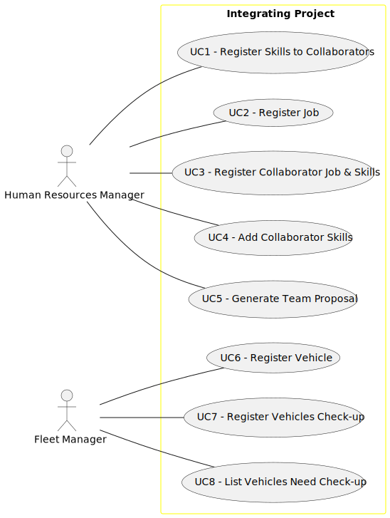

# Use Case Diagram (UCD)

**In the scope of this project, there is a direct relationship of _1 to 1_ between Use Cases (UC) and User Stories (US).**

However, be aware, this is a pedagogical simplification. On further projects and course units there may also exist _1 to N **and/or** N to 1_ relationships between UC and US.

**Insert below the Use Case Diagram in a SVG format**

**For each UC/US, it must be provided evidences of applying main activities of the software development process (requirements, analysis, design, tests and code). Gather those evidences on a separate file for each UC/US and set up a link as suggested below.**

# Use Cases / User Stories

| UC/US | Description                                                          |                   
|:------|:---------------------------------------------------------------------|
| US001 | [US001 - Register Collaborator Skills](../../us001/Readme.md)        |
| US002 | [US002 - Register Job ](../../us002/Readme.md)                       |
| US003 | [US003 - Register Collaborator Job & Skills](../../us003/Readme.md)  |
| US004 | [US004 - Add Collaborator Skills](../../us004/Readme.md)             |
| US005 | [US005 - Generate Proposal Team](../../us005/Readme.md)              |
| US006 | [US006 - Register Vehicle](../../us006/Readme.md)                    |
| US007 | [US007 - Register Vehicle´s Check-up](../../us007/Readme.md)         |
| US008 | [US008 - List Vehicles Need Check-up](../../us008/Readme.md)         |
