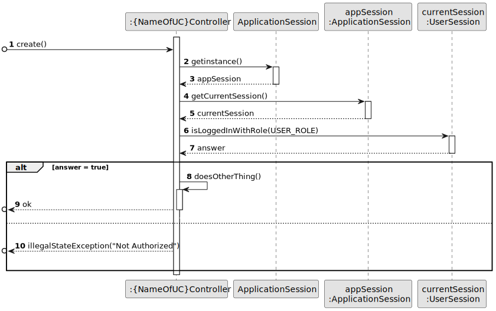
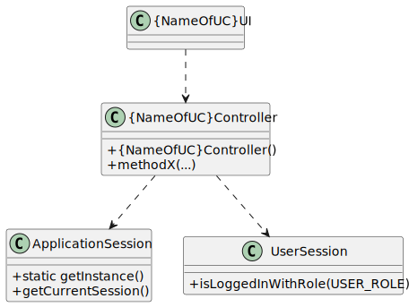

# Design

### Application Overview

The following sequence diagram graphically represents the intended flow for the application where there is a clear separation (decoupling) between the domain classes and the user interaction classes (_user interface_). This decoupling is performed by classes with the suffix _Controller_.

#### OBS:
- **{MenuX}UI** -> represents an instance of a UI class that presents several menu options and/or features to the user
- **{NameOfUC}UI** -> represents an instance of a specific UI class for the realization of a given use case / user story
- **{NameOfUC}Controller** -> represents an instance of a Controller class responsible for decoupling the UI from the Domain classes
- "**methodX(...)**" -> abstraction representing invoking a public method of {NameOfUC} Controller
- "**methodY(...)**" -> abstraction representing invoking a public method of any class belonging to the domain
- In the remaining sequence diagrams one should only focus on the content of the LOOP

The execution of some functionalities by users must be preceded and verified by an authorization mechanism based on users' roles.
This verification can be carried out as follows:

Users' authentication and authorization processes are reutilizing an external component called **_AuthLib_**.
Documentation regarding this component is available [here](docs/auth/README.md).

## Class Diagram

**Insert below the Class Diagram in a SVG format**

