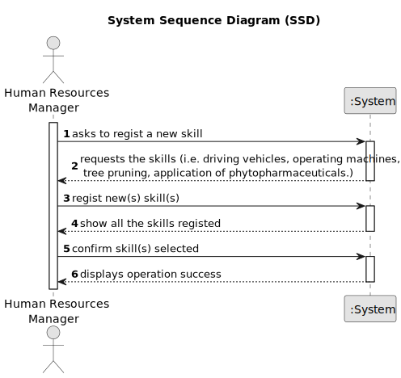

# US001 - Register Skills to Collaborators 

## 1. Requirements Engineering

### 1.1. User Story Description

As an organization employee (HRM), I want to register skills that may be appointed to a collaborator.

### 1.2. Customer Specifications and Clarifications 

**From the specifications document:**

> An employee has a main occupation (job) and a set of skills that enable him to perform/take on certain tasks/responsibilities, for example, driving vehicles of different types (e.g. light, or heavy), operating machines such as backhoes or tractors; tree pruning; application of phytopharmaceuticals.

**From the client clarifications:**

> **Question:** What criteria are needed to register a skill? What type of information does a skill have?
>
> **Answer:** The name of the skill, for example: Pruner, Heavy vehicle driver, Phytopharmaceutical applicator.

> **Question:** When a skill that already exists is created, what should the system do?
>
> **Answer:** By definition, it is not possible to have duplicate values in a set. Checking for duplicates is not a business rule, it is a technological one.

> **Question:** Which information can be introduced to create a new skill?
> 
> **Answer:** The skill name.

> **Question:** Which information is mandatory for creating a new skill?
>
> **Answer:** The skill name.

> **Question:** Which are the skills accepted? Or should we enable the HRM to introduce anything as a skill?
>
> **Answer:** All, it's up to HRM to decide. (special characters or algarisms should not be allowed in the skill name).

> **Question:**  Do I need to add skills  by writing them or can I just give a file with all of the skills?
> 
> **Answer:** Both are acceptable since the business the same the crucial difference resides in the UX.

> **Question:** Does the HRM need to see the confirmation of the sucess of the operation and the skills added or just the sucess of the operation?
>
> **Answer:** It will depends if you opt to insert one skil or a set of skils in a batch. Maybe some adaptation needed.

> **Question:** Is there any other possible outcome like if the HMR does not put the requested data, do I need to ask the user to to register a diferent competence?
>
> **Answer:** This US is quite simple, atm a skill is simply a name.

### 1.3. Acceptance Criteria

* **AC1:** The name of the skill.

### 1.4. Found out Dependencies

* This User Storie doesn't have any dependencie.

### 1.5 Input and Output Data

**Input Data:**

* Typed data:
    * The name of the skill.
	
* Selected data:
    * The name of the skill.

**Output Data:**

* List of existing skills

### 1.6. System Sequence Diagram (SSD)

### 1.7 Other Relevant Remarks

*