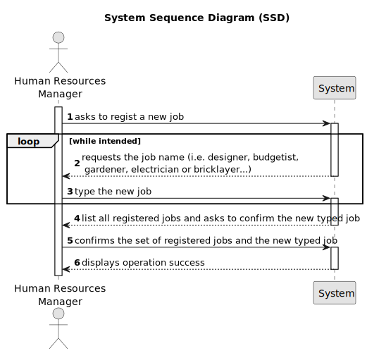

# US002 - Register Job

## 1. Requirements Engineering

### 1.1. User Story Description

As an HRM, I want to register a job that a collaborator need to have.

### 1.2. Customer Specifications and Clarifications 

**From the specifications document:**

> MS has a wide range of employees who carry out the most varied tasks in the context of designing and managing green spaces. Some job examples are designer, budgetist, gardener, electrician or bricklayer.

**From the client clarifications:**

> **Question:**
>É relevante associar uma área ou setor específico a cada Job? (Por exemplo, "Jardineiro" seria inserido no setor de "Manutenção"). Deve-se incluir informações como salário, tipo de contratação (full-time ou part-time), e modalidade de trabalho (presencial, remoto ou híbrido) no Job? Ou essas informações encaixam-se melhor no âmbito do colaborador, ou talvez nem sejam necessárias? Or is this information better suited to the employee, or perhaps not necessary at all? Que outras informações acha necessárias associar ao Job?
>
> **Answer:** Bom dia, não é necessário na medida que não existem US que sugiram que isso possa vir a ser necessário; - idem; - para já nenhumas. De nada.

> **Question:**
>What are the acceptance criteria? When are creating a job that already exit, what the system do?
>
> **Answer:** By definition a set can´t have duplicates. Assuring no duplicates is not a business rule is a technical issue.

> **Question:**
>Quais são os dados de entrada para a criação de uma profissão?
>
> **Answer:** O Nome da profissão: jardineiro, calceteiro, electricista, condutor,...

> **Question:**
>After register a job/vehicle's checkup should a message (sucess or failure) or a resume of the register appear?
>
> **Answer:** The UX/UI is up to dev teams.

> **Question:**
>Should we add a description or anything attribute for the Job registration? The id of Job is generated automatically by the system? 
> I guess a job can be assigned to a collaborator if he has the skills require for this job. How do we manage this relation. Does he HRM do it manually, or should we have an atribute in job specifiying the skills needed? 
> Do the job has to be registered before registering a collaborator? When we register a team, the collaborators has to have a job? What do you want to see as an output?
>
> **Answer:** Not need to, job is just a name; don't know what is job id, job is just a name; no; a collaborator is hired for a job and can have skills or not; 
>a collaborator is hired for a (valid) job; see 3 and 4; the UX/UI is to be decided by dev team.

### 1.3. Acceptance Criteria

* **AC1:** The name of the profession/job.

### 1.4. Found out Dependencies

* This User Storie doesn't have any dependencies.

### 1.5 Input and Output Data

**Input Data:**

* Typed data:
  * The name of the profession/job.

* Selected data:
  * The name of the profession/job.

**Output Data:**

* List of existing professions/jobs.

### 1.6. System Sequence Diagram (SSD)

### 1.7 Other Relevant Remarks