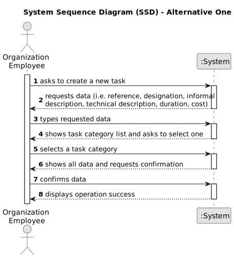

# US002 - Register Job

## 1. Requirements Engineering

### 1.1. User Story Description

As an HRM, I want to register a job that a collaborator need to have.

### 1.2. Customer Specifications and Clarifications 

**From the specifications document:**

> MS has a wide range of employees who carry out the most varied tasks in the context of designing and managing green spaces. Some job examples are designer, budgetist, gardener, electrician or bricklayer.

**From the client clarifications:**

> **Question:**
>When the HRM registers a job, is it necessary to provide a job description and inquire about the collaborator's qualifications? Should the system be able to display a list of all jobs currently registered? Does the system need to provide the capability to edit a job?
> 
> **Answer:** .

> **Question:**
>Can a job be anything? Should numbers or special char be allowed? Is there a minim or max number of char?
>
> **Answer:** (no response from the client to this question yet).

> **Question:**
>Is it relevant to associate a specific area or sector with each Job? (For example, "Gardener" would be inserted in the "Maintenance" sector). Should information such as salary, type of employment (full-time or part-time), and working method (face-to-face, remote or hybrid) be included in the Job? Or is this information better suited to the employee, or perhaps not necessary at all? What other information do you think should be included in the job?
>
> **Answer:**  Is not necessary as there is no US to suggest that it might be necessary. Idem. None at the moment.

> **Question:**
>What are the acceptance criteria? When are creating a job that already exit, what the system do?
>
> **Answer:** By definition a set can´t have duplicates. Assuring no duplicates is not a business rule is a tecnichal issue.

> **Question:**
>What are the criteries to accept a job category regist? Any business rule?
>
> **Answer:** (no response from the client to this question yet).

> **Question:**
>What are the inputs for creating a profession?
>
> **Answer:** Name of profession: gardener, cobbler, electrician, driver,...

> **Question:**
>-When you register a skill or job, which fields are filled in, for example, name, more specific description, identification number? Do you want all the fields, if there are more than one depending on the answer to the previous question, to be compulsory or optional, and which ones? In the case of the identification number, does the customer want to provide one, or have one assigned by the system? When something is successfully registered, do you only want to see a success message, or also a list of what has already been registered?
>
> **Answer:** (no response from the client to this question yet).

> **Question:**
> When the user registers a job does he select a job from a list or does he type out a custom job name? What data is introduced by the user when creating a job?
>
> **Answer:** (no response from the client to this question yet).
### 1.3. Acceptance Criteria

* **AC1:** The name of the profession/job.

### 1.4. Found out Dependencies

* This User Storie doesn't have any dependencies.

### 1.5 Input and Output Data

**Input Data:**

* Typed data:
  * The name of the profession/job.

* Selected data:
  * The name of the profession/job.

**Output Data:**

* List of existing professions/jobs.

### 1.6. System Sequence Diagram (SSD)

### 1.7 Other Relevant Remarks