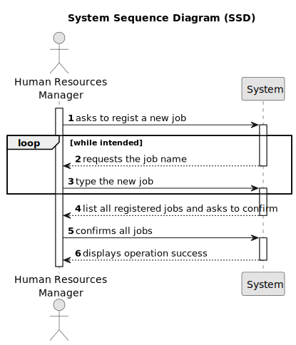

# US002 - Register Job

## 1. Requirements Engineering

### 1.1. User Story Description

As an HRM, I want to register a job that a collaborator need to have.

### 1.2. Customer Specifications and Clarifications 

**From the specifications document:**

> MS has a wide range of employees who carry out the most varied tasks in the context of designing and managing green spaces. Some job examples are designer, budgetist, gardener, electrician or bricklayer.

**From the client clarifications:**

> **Question:**
>É relevante associar uma área ou setor específico a cada Job? (Por exemplo, "Jardineiro" seria inserido no setor de "Manutenção"). Deve-se incluir informações como salário, tipo de contratação (full-time ou part-time), e modalidade de trabalho (presencial, remoto ou híbrido) no Job? Ou essas informações encaixam-se melhor no âmbito do colaborador, ou talvez nem sejam necessárias? Or is this information better suited to the employee, or perhaps not necessary at all? Que outras informações acha necessárias associar ao Job?
>
> **Answer:** Bom dia, não é necessário na medida que não existem US que sugiram que isso possa vir a ser necessário; - idem; - para já nenhumas. De nada.

> **Question:**
>What are the acceptance criteria? When are creating a job that already exit, what the system do?
>
> **Answer:** By definition a set can´t have duplicates. Assuring no duplicates is not a business rule is a tecnichal issue.

> **Question:**
>Quais são os dados de entrada para a criação de uma profissão?
>
> **Answer:** O Nome da profissão: jardineiro, calceteiro, electricista, condutor,...

### 1.3. Acceptance Criteria

* **AC1:** The name of the profession/job.

### 1.4. Found out Dependencies

* This User Storie doesn't have any dependencies.

### 1.5 Input and Output Data

**Input Data:**

* Typed data:
  * The name of the profession/job.

* Selected data:
  * The name of the profession/job.

**Output Data:**

* List of existing professions/jobs.

### 1.6. System Sequence Diagram (SSD)

### 1.7 Other Relevant Remarks