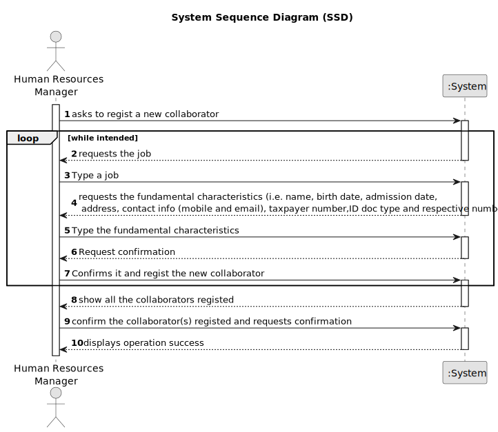

# US003 - Register Collaborator Job & Skills

## 1. Requirements Engineering

### 1.1. User Story Description

As an Human Resources Manager, I want to register a collaborator with a job and fundamental
characteristics.

### 1.2. Customer Specifications and Clarifications 

**From the specifications document:**

>	A collaborator is a person who is an employee of the organization and carries out
design, construction and/or maintenance tasks for green areas, depending on their
skills.

**From the client clarifications:**

> **Question:** Should the system able the Human Resources Manager to insert multiple collaborators in one interaction before saving them?
>
> **Answer:** it's not required to do so.

> **Question:**
When creating a collaborator with an existing name, what the system do?
>
> **Answer:**
It's not common and most improbable to have different individual with same name in the same context, however it’s ID documentation number should be unique for sure.

> **Question:**
Which information is mandatory to insert a collaborator in the program (fundamental characteristics)?
>
> **Answer:**
name, birth date, admission date, address, contact info (mobile and email), taxpayer number, ID doc type and respective number.

> **Question:**
Does the Human Resources Manager select the job from a list that we display?
>
> **Answer:**
displaying or not, It's a matter of UX, the dev team should decide about it, but the valid jobs are the ones created within the US02.

### 1.3. Acceptance Criteria

* **AC1:** name, birthdate, admission date, address, contact info (mobile and
  email), ID doc type and respective number should be provided by Human Resources Manager

### 1.4. Found out Dependencies

* There is a dependency on "US02- As an Human Resources Manager, I want to register a job that a collaborator need to have." as there must be at least one job which can be assigned to a collaborator.

### 1.5 Input and Output Data

**Input Data:**

* Typed data:
    * a reference
    * a designation 
    * an informal description
    * a technical description
    * an estimated duration
	
* Selected data:
    * a task category 

**Output Data:**

* (In)Success of the operation

### 1.6. System Sequence Diagram (SSD)

### 1.7 Other Relevant Remarks

* None.