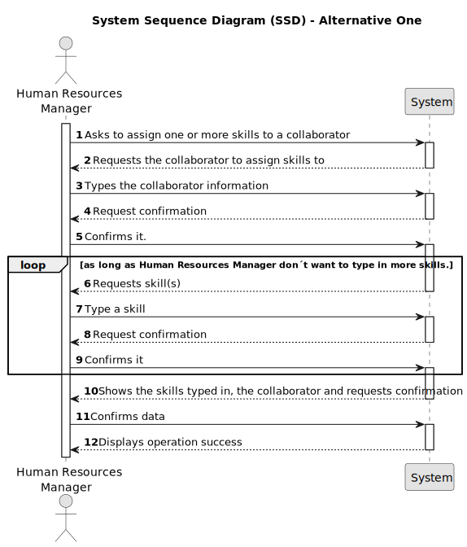

# US004 - Add Collaborator Skills

## 1. Requirements Engineering

### 1.1. User Story Description

As an Human Resources Manager, I want to assign one or more skills to a collaborator.

### 1.2. Customer Specifications and Clarifications 

**From the specifications document:**

>	Collaborator realises jobs, construction and maintenance depending on their skills. 

>	An employee has a main occupation and a set of skills that enable him to perform certain tasks.

**From the client clarifications:**

> **Question:** Se há um número mínimo e máximo de número de skills?
>
> **Answer:** Não.

> **Question:** Se há alguma característica especial que seja necessária o colaborar ter para que lhe sejam adicionadas estas skills?
> 
> **Answer:** Não.

> **Question:** Can any skill be registered to any collaborator/job? Or should they be associated in categories in association with a specific job ?
>
> **Answer:** There is no association, it totally depends of the CV of the collaborator.

> **Question:** Should it be possible to add the same skill to a collaborator multiple times?
>
> **Answer:** That does not make sense.

> **Question:** Is there any certification/proof needed to register a skill to a colaborator?
>
> **Answer:** No.

### 1.3. Acceptance Criteria

* **AC1:** All required fields must be filled in.

### 1.4. Found out Dependencies

* There is a dependency on "US001 - As a Human Resources Manager (HRM), I want to register skills that a
  collaborator may have." as there must be at least one skill which can be assigned to a collaborator.

### 1.5 Input and Output Data

**Input Data:**

* Typed data:
    * The collaborator
	
* Selected data:
    * One or more skills

**Output Data:**

* (In)Success of the operation

### 1.6. System Sequence Diagram (SSD)

### 1.7 Other Relevant Remarks

* None.