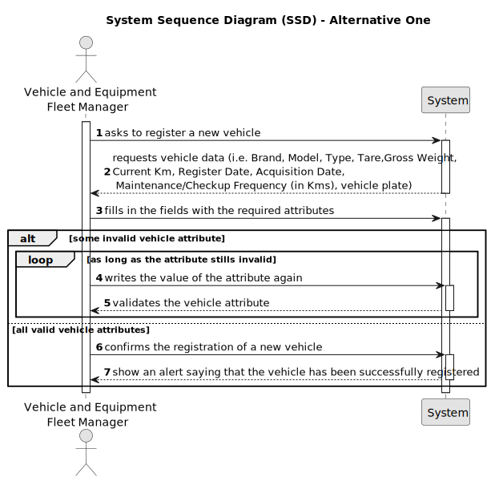

# US006 - Register Vehicle

## 1. Requirements Engineering

### 1.1. User Story Description

As an FM, I wish to register a vehicle including Brand, Model, Type, Tare,
Gross Weight, Current Km, Register Date, Acquisition Date, Maintenance/Checkup Frequency (in Kms).

### 1.2. Customer Specifications and Clarifications 

**From the specifications document:**

> Vehicles are needed to carry out the tasks assigned to the teams as well as to transport
machines and equipment. This type of vehicle can be only for passengers or mixed,
light or heavy, open box or closed vans or trucks. 
> As for machines, MS has tractors, backhoe loaders and rotating machines, lawnmowers, among others. The equipment can be greatly diverse, such as sprayers, lifting
platforms, chainsaws, brush cutters, blowers, ladders, cisterns and the various elements
that can be attached to tractors, such as disc harrows, weeders, aerators and scarifiers.

**From the client clarifications:**

> **Question:** For the application to work does the FM need to fill all the attributes of the vehicle?
>
> **Answer:** Yes, besides the vehicle plate that by mistake doesn't appear on the text.

> **Question:** Should the application identify a registered vehicle by a serial number or other attribute? Should the application a group the vehicles by their brand, serial number or other attribute? If the FM inserts the same vehicle by mistake, should it inform the user of the mistake and give him the option to add another vehicle?
>
> **Answer:** - By plate id. No requirements were set concerning groups of vehicles. Again, duplication of data is not a business rule is technical one, since by definition in a set you can't have duplicates.

### 1.3. Acceptance Criteria

* **AC1:** Provide the set of attributes necessary for the correct registration of a given vehicle.
* **AC2:** All attributes must be validated, there must be no negative values, no duplicate names or number plates and the date of purchase must not be more recent than the vehicle's registration date.

### 1.4. Found out Dependencies

* This User Storie doesn't have any dependencies.

### 1.5 Input and Output Data

**Input Data:**

* Typed data:
    * Brand
    * Model
    * Type 
    * Tare
    * Gross Weight
    * Current Km
    * Register Date
    * Acquisition Date
    * Maintenance/Checkup Frequency (in Kms)
    * Vehicle plate
	
* Selected data:
  * Brand
  * Model
  * Type
  * Tare
  * Gross Weight
  * Current Km
  * Register Date
  * Acquisition Date
  * Maintenance/Checkup Frequency (in Kms)
  * Vehicle plate

**Output Data:**

* Successful registration alert about the information on previously registered attributes for a particular vehicle.

### 1.6. System Sequence Diagram (SSD)

### 1.7 Other Relevant Remarks

* 