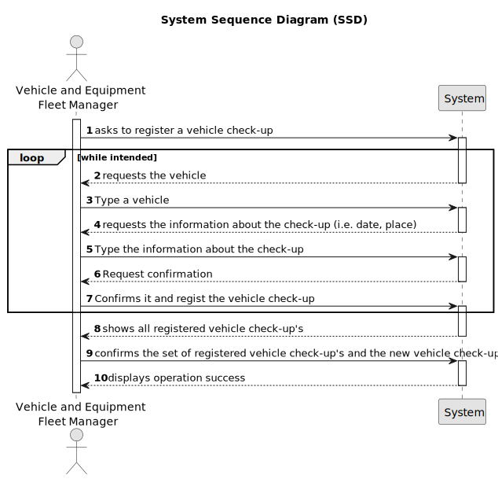

# US007 - Register Vehicle´s Check-up

## 1. Requirements Engineering

### 1.1. User Story Description

As an Fleet Manager, I wish to register a vehicle’s check-up.

### 1.2. Customer Specifications and Clarifications 

**From the specifications document:**

>	A Fleet Manager is a person who manages the fleet park, the machines, equipment and vehicles, ensuring their good condition and assigning them to the tasks to be carried out.

**From the client clarifications:**

> **Question:** Which is the unit of measurement used to estimate duration?
>
> **Answer:** Duration is estimated in days.

> **Question:** Monetary data is expressed in any particular currency?
>
> **Answer:** Monetary data (e.g. estimated cost of a task) is indicated in POT (virtual currency internal to the platform).

### 1.3. Acceptance Criteria

* **AC1:** The vehicle plate.
* **AC2:** The information of the check-up.

### 1.4. Found out Dependencies

* There is a dependency on "US06-As an Fleet Manager,I wish to register a vehicle including Brand, Model, Type, Tare, Gross Weight, Current Km, Register Date, Acquisition Date, Maintenance/Check up Frequency (in Kms)." as there must be at least one vehicle which can be assigned to a check-up.

### 1.5 Input and Output Data

**Input Data:**

* Typed data:
    * The vehicle
    * The information about the check-up
	
* Selected data:
  * The vehicle
  * The information about the check-up

**Output Data:**

* List of registered vehicle check-up's
* (In)Success of the operation

### 1.6. System Sequence Diagram (SSD)

### 1.7 Other Relevant Remarks

* None.