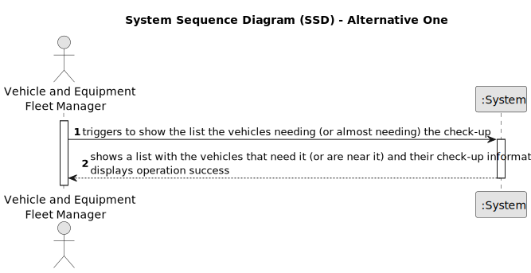

# US008 - List Vehicles Need Check-up 

## 1. Requirements Engineering

### 1.1. User Story Description

As a Fleet Manager, I want to list the vehicles needing the check-up.

### 1.2. Customer Specifications and Clarifications 

**From the specifications document:**

> The Vehicle and Equipment Fleet Manager manages the machines, equipment, and vehicles, ensuring their good condition.

**From the client clarifications:**

> **Question:** What are the requests/ input data to list the vehicles needing the check-up? Type of vehicle, Current Km and Maintenance/Check-up Frequency (in Kms) are sufficient?
>
> **Answer:** Current Km and Maintenance/Check-up Frequency (in Kms) are sufficient, yes.

> **Question:** Are there acceptance criteria when asking for the list?
>
> **Answer:** The list must contain all vehicles that have already exceeded the number of km required for the inspection or those that are close to it.

> **Question:** Can the vehicles get placed automatically on a list or the one listing has to be the FM?
>
> **Answer:** The list of vehicles is automatically created but the creation is triggered by the FM.

> **Question:** What information will appear on the final list regarding the vehicle,besides the needing for check-up?
>
> **Answer:** Data that allow to identify the vehicle like Plate, brand and modle, as well as, the data that allowed to select/insert te vehicle in the list, number of kms, frequecny of checkup and the last checkup.

### 1.3. Acceptance Criteria

### 1.4. Found out Dependencies

* There is a dependency on "US006 - As an FM, I wish to register a vehicle including Brand, Model, Type, Tare,
  Gross Weight, Current Km, Register Date, Acquisition Date, Maintenance/Check-up Frequency (in Kms)" as there must at least one vehicle.
* There is another dependency on "US007 - As an FM, I wish to register a vehicle’s check-up." as there must be at least one vehicle with check-up registered.

### 1.5 Input and Output Data

**Input Data:**
None

**Output Data:**

* List of the vehicles needing or almost needing a check-up.
* (In)success of the operation.

### 1.6. System Sequence Diagram (SSD)

### 1.7 Other Relevant Remarks

* None.